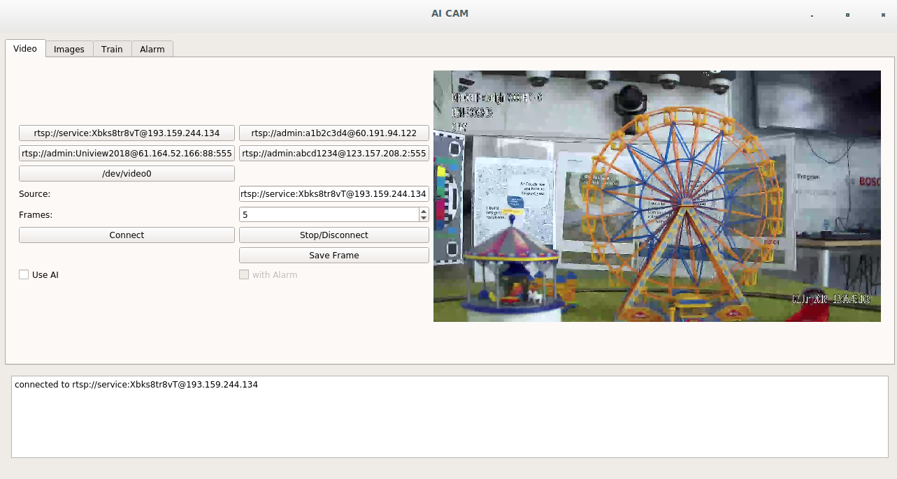
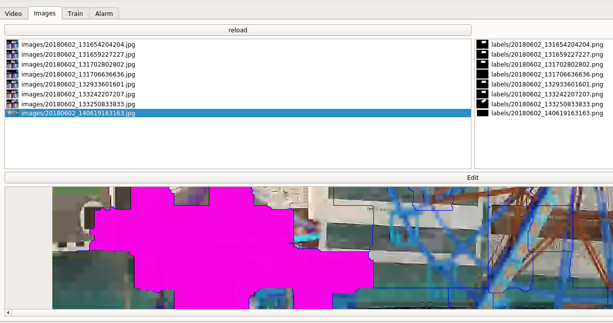
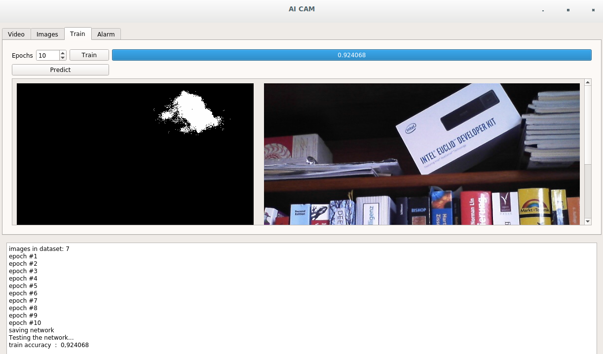
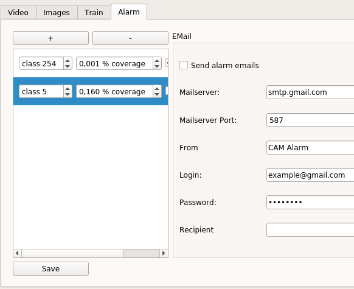
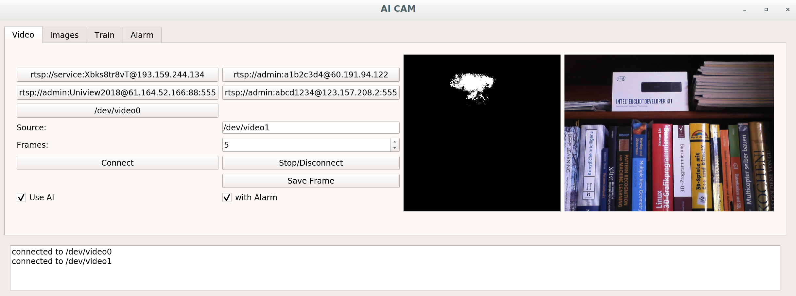

# ai_cam
Camera Stream combined with video segmentation.

1. Capture images from camera stream.
2. Label objects as classes in captured images.
3. Train Deep Neural Network.
4. Add Alarm rules for classes.

