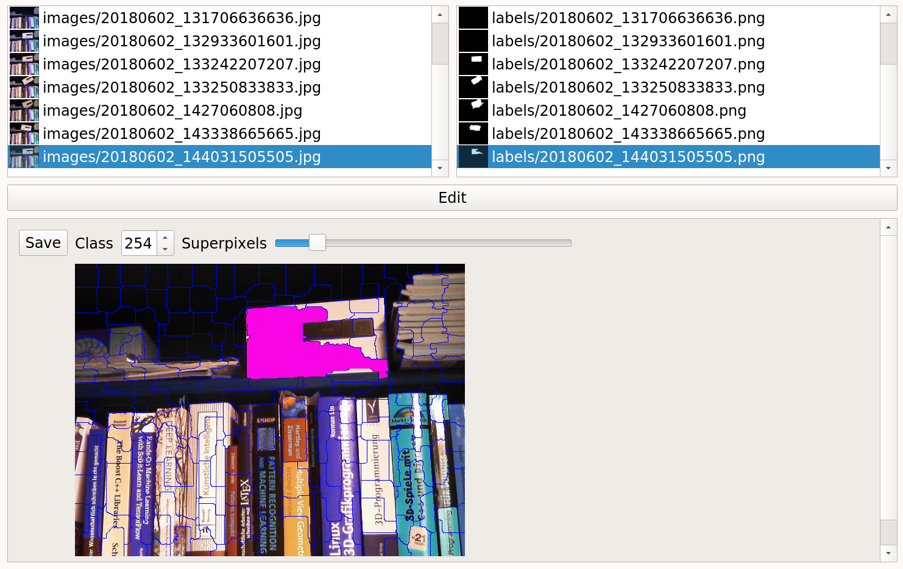
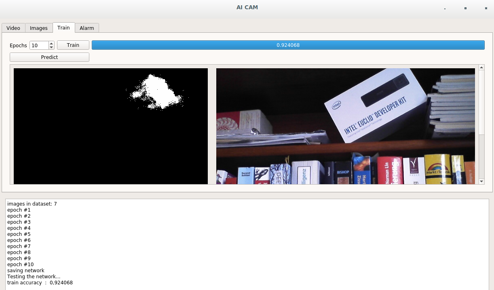

<!--pandoc -t beamer SLIDES.md -o slides.pdf -->

---
author:
- Christian M
subtitle: Artificial intelligence based alarm system for IP Cameras
title: AI CAM
titlepage-note: |
  Artificial intelligence based alarm system for IP Cameras. Just label objects, train, configure alarm rules, run!
fontsize: 17pt

---

## Just label objects, train, configure alarm rules, run!

\note{}

---

## THE ISSUE

It's hard to monitor multiple cameras at the same time without missing something. We need a system that notifies us when something special occurs in the camera streams. 

---

## OUR MAGIC SOLUTION

This project makes it easy to define classes to alert when they occur.
Based on video segmentation and easy 
pixel per class counting, we provide a program to easily define rules for alarm and notifications.

---

## HOW IT WORKS

### Label Classes

Safe some frame of the video stream. Then Label regions or objects on the captured images.

---

---

### Train

Press the train button to train the 'Artificial Intelligence'. You can add more images or change labels and retrain later.
You can  also train for more iterations to make the AI more accurate.

---

---

### Formulate Alarm Rules

Formulate alarm rules like, make an alarm when a class is more or less representative in the video than a threshold.
An alarm can also be sent as email.

---

---

### Run

AI will show predefined objects and alert when classes appear or disappear, based on alarm rules.

---